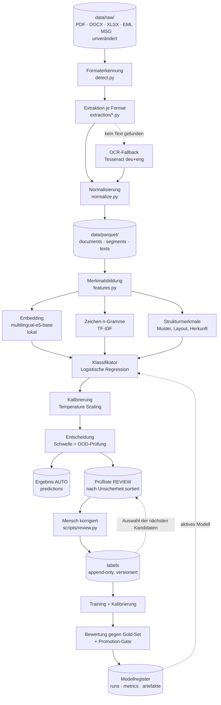

# Konzept: Lernfähige semantische Dokumentklassifikation

Stand: 2026-09-25

Ein Lernprojekt in der Tradition von [`bauprojekt-ai-pipeline`](../../bauprojekt-ai-pipeline/CLAUDE.md):
Dokumente jeder Art einlesen, Text extrahieren, den Inhalt **semantisch** einer Klasse
zuordnen, die Zuordnung mit einer **belastbaren Konfidenz** versehen — und das System durch
menschliche Korrekturen messbar besser machen.

Im Referenzprojekt steht in `pipeline.py` der Satz *„Ordnername bestimmt die Dokumentart.
Reicht für den Prototyp; später ggf. eine Klassifikation."* Genau diese Klassifikation ist
hier das Thema.

---

## 1. Ziel und Abgrenzung

**Ziel.** Ein Dokument beliebigen Formats geht hinein, heraus kommt:

```json
{
  "document_id": "a3f1…",
  "predicted_class": "RECHNUNG",
  "confidence": 0.94,
  "runner_up": {"class": "GUTSCHRIFT", "confidence": 0.04},
  "decision": "AUTO",
  "model_version": "clf-2026-09-25-r07",
  "evidence": ["Rechnungsnummer 2026-4711", "Zahlbar bis 30.10.2026", "USt-IdNr DE…"]
}
```

`decision` ist `AUTO` (Konfidenz über der Schwelle, keine Prüfung nötig) oder `REVIEW`
(geht in die Prüfliste und wird damit zum nächsten Trainingsbeispiel).

**Leitplanken** (analog zum Referenzprojekt):

- **Originale bleiben unverändert.** Verarbeitung erzeugt ausschließlich abgeleitete Daten.
- **Jede Vorhersage ist nachvollziehbar:** Modellversion, Merkmalsversion, Label-Stand.
- **Labels sind der wertvollste Bestand**, nicht das Modell. Modelle werden neu gebaut,
  Labels nicht. Sie werden append-only geführt, mit Herkunft und Historie.
- **Konfidenz ist eine Aussage über die Welt, keine Dekoration.** Wenn das System 0,9 sagt,
  müssen ungefähr 9 von 10 solcher Fälle richtig sein. Das wird gemessen, nicht behauptet.
- **Lokal zuerst.** Extraktion, Embeddings und Klassifikation laufen vollständig auf dem
  eigenen Rechner. Ein externes LLM ist nirgends im Entscheidungspfad.

**Nicht im Scope** (bewusst, erst später oder nie):

- Informationsextraktion aus dem Dokument (Betrag, Fälligkeit, Vertragspartner) — das ist
  ein Folgeschritt, der auf der Klasse aufsetzt.
- Trennung mehrerer Dokumente in einer Datei (Rechnung + Lieferschein in einem Scan-Stapel).
  Siehe [§ 11 Bekannte Grenzen](#11-bekannte-grenzen).
- Mandanten-/Rechtetrennung. Falls nötig, wird das Muster `project_id` aus dem
  Referenzprojekt übernommen.

---

## 2. Die Klassen

Das Klassenschema wird bereitgestellt und ist **Konfiguration, kein Code**
(`config/classes.yaml`). Jede Klasse hat einen stabilen Schlüssel, einen Anzeigenamen und
— wichtig — eine **Abgrenzungsbeschreibung in Prosa**:

```yaml
version: 1
classes:
  - key: RECHNUNG
    name: Rechnung
    description: >
      Zahlungsaufforderung eines Lieferanten. Enthält Rechnungsnummer, Rechnungsdatum,
      Positionen mit Einzel- und Gesamtbetrag, Umsatzsteuer und ein Zahlungsziel.
      Der Gesamtbetrag ist positiv und wird vom Empfänger geschuldet.
    not: >
      Keine Gutschrift (negativer Betrag oder Bezug auf eine stornierte Rechnung),
      kein Lieferschein (keine Beträge), kein Angebot (noch keine Leistung erbracht).
  - key: GUTSCHRIFT
    ...
  - key: VERTRAG
  - key: AGB
  - key: STATUSBERICHT
  - key: PROTOKOLL
  - key: SONSTIGES
    residual: true
```

Drei Gründe für dieses Format:

1. Die Beschreibung ist die **Definition für den Menschen**, der labelt. Uneinigkeit beim
   Labeln ist die häufigste Ursache dafür, dass Konfidenz nicht steigt (§ 9.4).
2. Die Beschreibung ist gleichzeitig der **Kaltstart für die Maschine**: Ihr Embedding
   dient als erster Klassenprototyp, bevor auch nur ein Dokument gelabelt ist (§ 8.1).
3. `version` erlaubt es, Auswertungen einem Klassenstand zuzuordnen. Ändert sich das
   Schema, sind alte Metriken nicht mehr vergleichbar — das muss sichtbar sein.

### `SONSTIGES` ist eine Falle

`SONSTIGES` ist keine semantische Klasse, sondern ein Rest. Es gibt kein gemeinsames
Merkmal von „alles, was keine Rechnung, kein Vertrag und kein Protokoll ist". Ein
Klassifikator, der darauf trainiert wird, lernt Rauschen.

Deshalb wird `SONSTIGES` **nicht als gewöhnliche Klasse gelernt**, sondern als Ergebnis
zweier Ablehnungen (§ 7.4): zu geringe Konfidenz *oder* zu große Distanz zu allen bekannten
Klassenprototypen. In Macro-F1 wird `SONSTIGES` getrennt ausgewiesen, nicht eingemittelt —
sonst schönt ein gut erkannter Rest die Gesamtzahl.

---

## 3. Architektur im Überblick



Der Kreis unten rechts ist die Lernschleife. Sie ist der eigentliche Gegenstand des
Projekts; alles links davon ist Zulieferung.

### Die Schritte

| # | Schritt | Modul | Ergebnis |
|---|---|---|---|
| 1 | **Erkennen** — Format aus Magic Bytes, nicht aus der Endung; Inhalts-Hash | `detect.py`, `pipeline.py` | `Document` je Dateiversion |
| 2 | **Extrahieren** — je Format ein reiner Extraktor; OCR nur wenn nötig | `extraction/` | `Segment` (Seite, Blatt, Abschnitt, Mailteil) |
| 3 | **Normalisieren** — NFKC, Silbentrennung, Kopf-/Fußzeilen, Whitespace | `normalize.py` | `text` je Dokument und Segment |
| 4 | **Merkmale bilden** — Embedding + Zeichen-n-Gramme + Strukturmerkmale | `features.py` | Merkmalsvektor je Dokument |
| 5 | **Klassifizieren** — lineares Modell, danach Kalibrierung | `classify.py`, `calibrate.py` | Wahrscheinlichkeiten je Klasse |
| 6 | **Entscheiden** — Schwelle und OOD-Prüfung | `decide.py` | `AUTO` oder `REVIEW` |
| 7 | **Prüfen lassen** — unsicherste und vielfältigste Fälle zuerst | `sampling.py`, `scripts/review.py` | neue Labels |
| 8 | **Nachtrainieren und bewerten** — mit Gold-Set und Promotion-Gate | `train.py`, `evaluate.py` | neue Modellversion oder Ablehnung |

Schritte 1–3 sind Phase 1, 4–6 Phase 2, 7–8 Phase 3.

---

## 4. Datenmodell

Vier Ebenen, bewusst getrennt — dieselbe Logik wie `Document → Segment → Chunk` im
Referenzprojekt:

| Modell | Bedeutung | Warum eigen |
|---|---|---|
| `Document` | Eine Version einer Datei, identifiziert über den Inhalts-Hash | Geänderte Datei = neue Version; die alte bleibt erhalten und bleibt bewertbar |
| `Segment` | Eine Einheit im Dokument: PDF-Seite, Tabellenblatt, Mail-Körper, Anhang | Gespeichert, damit Merkmale neu gebildet werden können, ohne die Originale erneut zu lesen |
| `Features` | Der Merkmalsvektor plus die `feature_version`, die ihn erzeugt hat | Merkmale sind teuer (Embedding); sie werden einmal berechnet und wiederverwendet |
| `Label` | Die Wahrheit für ein Dokument, mit Herkunft und Zeitpunkt | Der einzige Bestand, der nicht neu erzeugt werden kann |

### Labels als Ereignisprotokoll

```
label_events(
  event_id, document_id, class_key, source, actor, created_at, note, supersedes
)
```

`source` ∈ {`human`, `bootstrap`, `llm`, `rule`, `generator`}. Labels werden **nie
überschrieben**, sondern durch ein neues Ereignis abgelöst. Der aktuelle Stand ist eine
Sicht auf das jeweils jüngste Ereignis je Dokument.

Das kostet fast nichts und zahlt sich dreifach aus:

- **Reproduzierbarkeit.** Ein Trainingslauf speichert den Hash des Label-Snapshots. Ein
  Modell von vor drei Wochen lässt sich exakt nachbauen.
- **Fehlersuche.** Wenn die Metrik einbricht, sieht man, welche Labels dazwischen kamen.
- **Meinungswechsel sind Daten.** Wenn dasselbe Dokument dreimal umgelabelt wurde, ist die
  Klassendefinition unscharf — und zwar messbar (§ 9.4).

Ablage: Phase 1–3 SQLite (`data/labels.db`), Phase 4 PostgreSQL. Die Schnittstelle in
`labels.py` bleibt dieselbe.

---

## 5. Ingestion: Formate und Extraktion

### Formaterkennung

Die Dateiendung ist eine Behauptung, kein Fakt. Erkannt wird über Magic Bytes
(`puremagic` oder `python-magic`), die Endung dient nur als Tiebreak. Eine `.pdf`, die in
Wahrheit ein gescanntes TIFF ist, oder eine `.xls`, die HTML enthält, sind in echten
Beständen der Normalfall.

### Extraktoren

| Format | Werkzeug | Segmentierung | Anmerkung |
|---|---|---|---|
| PDF (digital) | **PyMuPDF** | Seite | Wie Referenzprojekt; liefert auch Schriftgrößen für Überschriften |
| PDF (gescannt) | **OCRmyPDF** + Tesseract `deu+eng` | Seite | Automatischer Fallback, siehe unten |
| DOCX | **python-docx** | Absatzgruppe / Überschrift | |
| DOC, RTF, ODT | **Apache Tika** im Container | Absatz | Einziger Java-Baustein; lohnt nur für diese Exoten |
| XLSX, XLS | **openpyxl** | Blatt, dann Zeilenblock | Zahlenlastig — Strukturmerkmale wichtiger als Text |
| CSV | **Polars** | Zeilenblock | |
| PPTX | **python-pptx** | Folie | |
| EML | **stdlib `email`** (`BytesParser`, `policy.default`) | Header, Körper, je Anhang | siehe unten |
| MSG | **extract-msg** | wie EML | Outlook-Format |
| HTML | **selectolax** | Abschnitt | |
| PNG, JPG, TIFF | **pytesseract** | Bild | |

**OCR-Fallback, deterministisch:** Ein Dokument geht in OCR, wenn der extrahierte Text
weniger als *N* Zeichen pro Seite ergibt (Startwert 120). Der Schwellwert steht in der
Konfiguration und die Entscheidung wird am `Document` vermerkt (`ocr_applied`), damit man
später auswerten kann, ob OCR-Dokumente systematisch schlechter klassifiziert werden.
Erfahrungsgemäß tun sie das — und das ist eine eigene Erkenntnis, keine Panne.

**E-Mails sind Bäume, keine Dokumente.** Eine Mail mit angehängter Rechnung besteht aus
zwei Dokumenten mit unterschiedlicher Klasse. Die Regel:

- Der Mailkörper wird ein eigenes `Document` (Klasse z. B. `ANSCHREIBEN` oder `SONSTIGES`).
- **Jeder Anhang wird ein eigenständiges `Document`** mit `parent_document_id` auf die Mail,
  rekursiv (Mail in Mail in ZIP).
- Der Betreff und die Absenderdomain der Elternmail werden als **Strukturmerkmale** an das
  Kind vererbt (§ 6.3). Das ist ein starkes Signal: Mails von `rechnung@…` enthalten
  überdurchschnittlich oft Rechnungen.
- Die Mail selbst wird nie durch ihren Anhang klassifiziert und umgekehrt.

### Normalisierung

Alle Extraktoren liefern in dieselbe Normalisierung: Unicode NFKC, zusammengefasster
Whitespace, aufgelöste Silbentrennung am Zeilenende (`Rech-\nnung` → `Rechnung`), entfernte
wiederkehrende Kopf- und Fußzeilen (eine Zeile, die auf >60 % der Seiten fast gleich
auftaucht, ist Layout und kein Inhalt).

Ohne diesen Schritt lernt der Klassifikator die Fußzeile der Buchhaltungssoftware statt den
Inhalt — der Klassiker unter den versteckten Abkürzungen.

---

## 6. Merkmale: worauf der Klassifikator schaut

Drei Merkmalsblöcke werden aneinandergehängt. Der Grund für die Mischung: Embeddings
verstehen Bedeutung, aber übersehen Formalia; n-Gramme und Muster sehen Formalia, aber
keine Bedeutung. Dokumentklassen leben von beidem.

### 6.1 Semantik: Embedding

- Modell **`intfloat/multilingual-e5-base`**, 768 Dimensionen, lokal über
  `sentence-transformers` — dasselbe Modell wie im Referenzprojekt, damit die Erfahrungen
  übertragbar bleiben.
- **Dokument-Embedding aus Chunk-Embeddings:** Text in ~1200-Zeichen-Chunks, jeder
  eingebettet, dann positionsgewichteter Mittelwert. Frühe Chunks zählen mehr — der
  Dokumentkopf trägt die Klasseninformation fast immer (Betreff, Briefkopf, Überschrift).
  Gewicht `w_i = 1 / (1 + i/4)`, normiert.
- **Zusätzlich separat:** das Embedding der ersten 1000 Zeichen als eigener Block. Bei
  langen Verträgen verwässert der Mittelwert sonst genau die Stelle, auf die es ankommt.
- E5 verlangt das Präfix `query: ` bzw. `passage: ` — hier durchgehend `passage: `.
  Konsistenz zwischen Training und Anwendung ist Pflicht, sonst driften die Vektoren.

### 6.2 Wortlaut: Zeichen-n-Gramme

TF-IDF über **Zeichen-n-Gramme (3–5)** statt Wort-n-Gramme. Zwei Gründe, beide deutsch:

- **Komposita.** „Rechnungsbetrag", „Rechnungsnummer", „Schlussrechnung" teilen sich
  Zeichenfolgen, aber kein Wort. Das Referenzprojekt löst das mit `compound-split`;
  Zeichen-n-Gramme lösen es ohne zusätzliche Abhängigkeit.
- **OCR-Robustheit.** „Rechnunq" ist für ein Wortmodell ein unbekanntes Wort, für ein
  Zeichenmodell fast dasselbe wie „Rechnung".

Vokabular auf ~50 000 Merkmale begrenzt, danach `TruncatedSVD` auf 256 Dimensionen, damit
der Block nicht die dichten Embeddings erschlägt.

### 6.3 Form und Herkunft: Strukturmerkmale

Rund 40 billige, erklärbare Zahlen. Sie sind **Merkmale, keine Regeln** — das Modell
entscheidet über ihr Gewicht, niemand schreibt `if IBAN then Rechnung`:

| Gruppe | Beispiele |
|---|---|
| Umfang | Seitenzahl, Zeichen pro Seite, Anzahl Segmente |
| Zahlen | Anteil Ziffern, Anzahl Beträge (`\d{1,3}(\.\d{3})*,\d{2}\s*(€\|EUR)`), Anzahl Prozentwerte |
| Muster | IBAN, USt-IdNr, Steuernummer, Rechnungsnummer-artige Zeichenfolgen, Datumsdichte |
| Layout | Tabellenanteil, Anteil sehr kurzer Zeilen, Vorhandensein einer Unterschriftenzeile |
| Schlüsselwörter | normierte Häufigkeit von „Zahlungsziel", „Gutschrift", „Vertragspartner", „§", „TOP", „Anwesend", „Kündigungsfrist" |
| Herkunft | MIME-Typ, `ocr_applied`, Dateinamen-Tokens, Absenderdomain der Elternmail, Betreff-Tokens |

Die Schlüsselwortliste wird **aus den Labels gelernt**, nicht geraten: nach jeder
Trainingsrunde die Terme mit höchster punktweiser Transinformation je Klasse ausgeben und
die Liste bei Bedarf ergänzen. Damit wächst auch dieser Block mit.

### 6.4 Versionierung

Jeder Merkmalsvektor trägt eine `feature_version`. Ändert sich ein Extraktor, eine
Normalisierung oder die Merkmalsliste, steigt die Version und die Vektoren werden neu
gerechnet. **Ein Modell darf nur Merkmale derselben Version sehen, mit denen es trainiert
wurde.** Ohne diese Regel entstehen die Fehler, die man nicht findet.

---

## 7. Klassifikation und Konfidenz

### 7.1 Das Modell

**Multinomiale logistische Regression** (`scikit-learn`, `solver="saga"`, `class_weight="balanced"`).

Warum ausgerechnet das einfachste Modell:

- Es liefert **von Natur aus Wahrscheinlichkeiten**, keine nachträglich umgedeuteten Scores.
  Genau das braucht die Aufgabenstellung.
- Es trainiert in Sekunden auf der CPU. Eine Lernschleife, deren Runde 20 Sekunden dauert,
  wird benutzt; eine, die 40 Minuten dauert, nicht. Das entscheidet über den Lernerfolg des
  Projekts mehr als jeder Prozentpunkt F1.
- Die Gewichte sind lesbar. `coef_` je Klasse gegen die Merkmalsnamen zeigt sofort, ob das
  Modell auf „Zahlungsziel" oder auf „Seite 1 von 3" achtet.
- Auf 768-dimensionalen Embeddings ist ein linearer Kopf fast immer nur wenige Punkte
  schlechter als ein feingetunter Transformer — bei einem Bruchteil des Aufwands.

Zwei Alternativen als Vergleichsarm in derselben Bewertung mitlaufen lassen (`train.py
--model`), weil ein Baseline-Vergleich billig ist:

- **Nearest-Centroid / Prototyp** auf den Embeddings: der *Sofortlerner*. Ein neues Label
  verschiebt nur einen Mittelwert, es gibt gar kein Training. Deckt den Kaltstart ab und ist
  die ehrliche Untergrenze, gegen die sich alles andere beweisen muss.
- **Linear SVM** bzw. `SGDClassifier`: oft minimal genauer, liefert aber keine
  Wahrscheinlichkeiten — bräuchte zwingend die Kalibrierung aus § 7.3.

### 7.2 Was Konfidenz hier bedeutet

Die rohe Softmax-Ausgabe `p̂(c|x)` ist **keine** Wahrscheinlichkeit im nützlichen Sinne.
Sie ist eine Zahl zwischen 0 und 1, die sich zu 1 summiert. Ob sie stimmt, ist eine
empirische Frage.

Verwendet werden drei Ableitungen, weil sie Verschiedenes messen:

| Größe | Formel | Wofür |
|---|---|---|
| **Konfidenz** | `max_c p̂(c\|x)` | Die berichtete Zahl, Grundlage der Schwelle |
| **Margin** | `p̂_(1) − p̂_(2)` | Auswahl für die Prüfliste — trennt „unsicher zwischen zwei" von „unsicher zwischen allen" |
| **Entropie** | `−Σ p̂ log p̂` | Erkennt breite Unsicherheit, typisch für unbekannte Klassen |

Für Mehrklassenprobleme ist **Margin** das bessere Auswahlkriterium als Konfidenz: Ein
Dokument mit 0,45/0,44/0,11 sitzt genau auf der Entscheidungsgrenze zwischen Rechnung und
Gutschrift und ist beim Labeln viel wertvoller als eines mit 0,40/0,20/0,20/0,20.

### 7.3 Kalibrierung — der Schritt, der meistens fehlt

Ohne Kalibrierung ist eine logistische Regression auf hochdimensionalen Merkmalen
systematisch **überheblich**: Sie sagt 0,97 und trifft in 0,84 der Fälle.

**Verfahren: Temperature Scaling.** Ein einziger Parameter `T`, gelernt auf einer
**separaten Kalibriermenge** (nicht Trainings-, nicht Gold-Set) durch Minimierung der
Negative Log-Likelihood:

```
p̂_kalibriert = softmax(logits / T)
```

Warum ein Parameter genügt und warum das der richtige Ansatz ist:

- `T` verändert **keine einzige Entscheidung** — die Rangfolge der Klassen bleibt gleich.
  Kalibrierung verbessert also nie die Genauigkeit und kann sie auch nie verschlechtern.
  Sie repariert ausschließlich die *Zahl*. Diese Trennung ist sauber und macht die
  Auswertung interpretierbar.
- Mit einem Parameter ist Überanpassung auf der Kalibriermenge praktisch ausgeschlossen —
  anders als bei isotoner Regression, die bei wenigen hundert Beispielen gerne auswendig
  lernt.

Alternativen, falls Temperature Scaling nicht reicht (in `calibrate.py` austauschbar):
**Vector Scaling** (ein Parameter je Klasse, hilft bei stark unterschiedlicher
Klassenhäufigkeit), **isotone Regression je Klasse** (`CalibratedClassifierCV(method="isotonic")`,
erst ab ~1000 Kalibrierbeispielen sinnvoll).

Solange die Datenmenge klein ist, wird die Kalibriermenge per **stratifizierter
Kreuzvalidierung** gewonnen (`cv=5`), damit kein Beispiel verloren geht.

### 7.4 Die Entscheidung: `AUTO`, `REVIEW` oder `SONSTIGES`

```
konfidenz  = max_c p̂_kalibriert(c|x)
ood_score  = Distanz von x zum nächstgelegenen Klassenprototyp im Embedding-Raum
             (Kosinus zum Mittelwert der k=10 nächsten Trainingsnachbarn)

wenn ood_score > δ                    →  SONSTIGES, decision = REVIEW
sonst wenn konfidenz < τ              →  bester Vorschlag, decision = REVIEW
sonst                                 →  bester Vorschlag, decision = AUTO
```

**τ wird nicht geraten.** Es wird auf der Kalibriermenge aus der Risiko-Abdeckungs-Kurve
abgelesen: das kleinste τ, bei dem die Präzision oberhalb von τ das Ziel erreicht (Startwert
98 %). τ gehört zur Modellversion und wird mit ihr gespeichert.

Die OOD-Prüfung ist nötig, weil ein lineares Modell auf einem Dokument, das keiner Klasse
ähnelt, trotzdem selbstbewusst sein kann — es kennt nur seine sieben Klassen und verteilt
die Masse auf sie. Die Distanz im Embedding-Raum ist unabhängig davon und fängt genau den
Fall ab, der den Rest verdirbt.

---

## 8. Lernfähigkeit: wie das System besser wird

Das ist der Kern des Projekts. Die Lernschleife hat vier Teile: Kaltstart, Auswahl,
Übernahme, Freigabe.

### 8.1 Kaltstart ohne ein einziges Label

Ein Klassifikator braucht Trainingsdaten, die noch niemand erzeugt hat. Auflösung in drei
Stufen, jede billiger als von Hand anzufangen:

1. **Klassenbeschreibungen einbetten.** Die `description` aus `classes.yaml` wird mit
   demselben E5-Modell eingebettet und dient als erster Prototyp. Nearest-Centroid gegen
   diese Prototypen liefert sofort eine Zero-Shot-Klassifikation — schwach, aber weit über
   Raten.
2. **Vorschlagen statt fragen.** Die Prüfliste zeigt von Anfang an einen Vorschlag. Ein
   Mensch bestätigt in ein paar Sekunden; er tippt nur bei Widerspruch. Das ist erfahrungs-
   gemäß drei- bis fünfmal schneller als freies Labeln.
3. **Optional: lokales LLM als Vorlabeler.** Ein Ollama-Modell bekommt Klassenliste und
   die ersten 2000 Zeichen und antwortet strukturiert über Pydantic AI (wie im
   Referenzprojekt). Diese Labels bekommen `source = "llm"` und wiegen im Training weniger
   (`sample_weight` 0,3). Ein Mensch, der sie bestätigt, erzeugt ein neues Ereignis mit
   `source = "human"` und vollem Gewicht.

**Wichtig:** LLM-Labels gehen nie ins Gold-Set. Ein Modell, das gegen die Meinung eines
anderen Modells gemessen wird, misst Ähnlichkeit, nicht Wahrheit.

### 8.2 Auswahl: welche 25 Dokumente lohnen sich als nächstes?

Dies ist der Punkt, an dem aktives Lernen seinen Wert hat oder nicht hat. Zufällig gewählte
Dokumente sind überwiegend leichte Fälle, die das Modell schon kann — jedes gelabelte
leichte Beispiel ist verschenkte Arbeit.

**Zweistufiges Verfahren, `sampling.py`:**

**Stufe 1 — Unsicherheit.** Aus allen ungelabelten Dokumenten die 200 mit dem kleinsten
Margin `p̂_(1) − p̂_(2)`. Das sind per Definition die Fälle, die am nächsten an der
Entscheidungsgrenze liegen; ein Label dort verschiebt die Grenze am meisten.

**Stufe 2 — Vielfalt.** Die 200 Kandidaten werden im Embedding-Raum mit k-Means in 25
Gruppen geteilt; aus jeder Gruppe wird das unsicherste Dokument genommen.

Stufe 2 ist nicht optional. Reines Uncertainty Sampling wählt in der Praxis 25-mal fast
dasselbe Dokument — dieselbe Rechnungsvorlage desselben Lieferanten, die zufällig unklar
ist. Der Informationsgewinn des 25. Exemplars ist null. Die Kombination aus Unsicherheit
und Abdeckung ist die vereinfachte Fassung dessen, was BADGE macht (Gradienteneinbettung +
k-means++), und für ein Lernprojekt die richtige Abstraktionsebene: gleicher Effekt,
nachvollziehbarer Code.

**Beigemischt: 10 % Zufall.** Wenn das Modell eine ganze Region des Raums fälschlich für
sicher hält, sieht reines Uncertainty Sampling sie nie. Eine kleine Zufallsbeimischung
findet solche blinden Flecken und liefert nebenbei eine unverzerrte Stichprobe.

**Gegenprobe im Betrieb:** Dokumente mit hoher Konfidenz gelegentlich stichprobenartig
prüfen. Wenn dort Fehler auftauchen, ist nicht das Modell schlecht, sondern die Konfidenz
gelogen — ein ganz anderes Problem mit einer ganz anderen Behandlung (§ 9.4).

### 8.3 Übernahme: vom Label zum neuen Modell

```bash
uv run scripts/review.py --limit 25     # Prüfliste, schreibt label_events
uv run scripts/train.py                 # trainiert, kalibriert, bewertet, registriert
```

`train.py` macht in dieser Reihenfolge:

1. Label-Snapshot ziehen und hashen.
2. **Vollständig neu trainieren**, nicht inkrementell nachlernen.
3. Auf der Kalibriermenge `T` und τ bestimmen.
4. Gegen das Gold-Set bewerten (§ 9).
5. Promotion-Gate prüfen (§ 8.4).
6. Lauf im Register ablegen: Label-Hash, `feature_version`, Hyperparameter, Metriken,
   Modellartefakt, Zeitstempel.

**Warum kein inkrementelles Lernen?** Es wäre der offensichtliche Weg und ist hier der
falsche. Ein inkrementell fortgeschriebenes Modell hängt von der *Reihenfolge* der Labels
ab. Damit ist ein Lauf nicht reproduzierbar, zwei Läufe sind nicht vergleichbar, und ein
falsches Label lässt sich nicht mehr sauber zurücknehmen. Vollständiges Neutraining kostet
bei diesen Datenmengen Sekunden — der Preis ist niedriger als der Verlust an
Nachvollziehbarkeit. (Bei Millionen Dokumenten sähe die Rechnung anders aus; dann ist die
Antwort aber Feature-Caching und paralleles Training, nicht Reihenfolgeabhängigkeit.)

### 8.4 Freigabe: das Promotion-Gate

Ein neu trainiertes Modell ersetzt das aktive **nur**, wenn es auf dem Gold-Set alle vier
Bedingungen erfüllt:

```
Macro-F1_neu        ≥ Macro-F1_aktiv − 0,01      (keine Gesamtregression)
ECE_neu             ≤ ECE_aktiv     + 0,01       (Konfidenz nicht schlechter geeicht)
Coverage@P98_neu    ≥ Coverage@P98_aktiv         (nicht weniger Automatisierung)
min_c F1_neu(c)     ≥ min_c F1_aktiv(c) − 0,05   (keine Klasse geopfert)
```

Die vierte Bedingung ist die wichtigste und wird am häufigsten vergessen. Ohne sie steigt
die Gesamtmetrik fröhlich weiter, während die seltene, aber geschäftlich wichtige Klasse
`GUTSCHRIFT` still zusammenbricht.

Ein abgelehnter Lauf wird trotzdem registriert — mit Begründung. Die Folge fehlgeschlagener
Läufe ist eine der aufschlussreichsten Aufzeichnungen des Projekts.

### 8.5 Spätere Ausbaustufen

Erst wenn die Schleife läuft und gemessen ist:

- **SetFit** — kontrastives Feintuning des Embedders auf den vorhandenen Labelpaaren, dann
  wieder linearer Kopf. Holt typischerweise mehrere Punkte Macro-F1 bei 50–200 Labels je
  Klasse und braucht Minuten statt Stunden. Der natürliche nächste Schritt.
- **Confident Learning** (`cleanlab`) — findet Labels, die dem Modell konsistent
  widersprechen. Ein Teil davon sind echte Labelfehler. Fehlerhafte Labels sind die
  häufigste Ursache für eine Lernkurve, die bei 0,85 stehenbleibt.
- **LLM-Eskalation** — nur bei `REVIEW`: das lokale Modell schlägt eine Klasse vor und
  begründet sie. Die Entscheidung bleibt beim Klassifikator; das LLM beschleunigt den
  Menschen.
- **Mehrfachlabel** — falls sich zeigt, dass Dokumente regelmäßig zwei Klassen zugleich
  sind (Vertrag *mit* AGB im Anhangsteil). Dann `OneVsRest` mit klassenweisen Schwellen
  statt Softmax.

---

## 9. Messen: Wirkt die Lernschleife wirklich?

Die entscheidende Frage des Projekts — und die, bei der man sich am leichtesten selbst
belügt.

### 9.1 Der Denkfehler, den man zuerst ausräumen muss

„Die Konfidenz durch Training steigern" klingt nach einem eindeutigen Ziel. Es ist zweideutig:

|  | Genauigkeit steigt | Genauigkeit bleibt gleich |
|---|---|---|
| **Konfidenz steigt** | ✅ Das Ziel | ❌ Überheblichkeit — das System wird gefährlicher, nicht besser |
| **Konfidenz bleibt gleich** | ⚠️ Gut, aber die Zahl ist unbrauchbar (unterheblich) | — kein Fortschritt |

Die Konfidenz eines Modells lässt sich **trivial** auf 0,99 bringen: Temperatur `T` auf 0,3
setzen. Keine einzige Vorhersage wird dadurch besser. Ein Fortschrittsbericht, der nur die
mittlere Konfidenz zeigt, ist deshalb wertlos.

**Konfidenz wird immer als Paar gemessen:**

- **Trennschärfe** — trennt die Konfidenz richtige von falschen Vorhersagen?
- **Eichung** — entspricht die Zahl der beobachteten Trefferquote?

Ein Modell kann trennscharf und schlecht geeicht sein (dann hilft Kalibrierung, § 7.3) oder
gut geeicht und stumpf (dann hilft nur besseres Lernen).

### 9.2 Das Gold-Set

Alles steht und fällt damit.

- **Eingefroren**, stratifiziert, mindestens 50 Dokumente je Klasse (bei sieben Klassen also
  ~350). Bei weniger sind Unterschiede von 2 Punkten F1 statistisch nicht von Rauschen zu
  unterscheiden.
- **Nie im Training. Nie in der Kalibriermenge. Nie von der Prüfliste wählbar.** Die
  Auswahlfunktion filtert Gold-Set-IDs hart heraus — im Code, nicht per Konvention.
- **Dedupliziert gegen den Trainingsbestand**, und zwar nicht nur über den Inhalts-Hash
  (der findet nur identische Dateien), sondern über **MinHash/SimHash** auf dem
  normalisierten Text. Dieselbe Rechnungsvorlage mit anderer Rechnungsnummer ist praktisch
  dasselbe Dokument; steht sie in beiden Mengen, ist die Metrik geschönt.
- **Aufgeteilt nach Dokumentfamilie, nicht nach Datei.** Zwei Versionen desselben Vertrags
  dürfen nicht auf beide Seiten fallen.
- Aus dem **synthetischen Generator** mit bekannter Wahrheit (analog `docs/testdaten.md` im
  Referenzprojekt), später ergänzt um eine von Hand gelabelte Realitätsprobe. Beide getrennt
  ausweisen: ein Modell, das auf Synthetik glänzt und auf Realität einbricht, hat die
  Vorlage gelernt, nicht die Klasse.

### 9.3 Die Kennzahlen

**Qualität**

- **Macro-F1** (Hauptzahl; nicht Accuracy — die belohnt nur die häufigste Klasse)
- **F1 je Klasse** und die vollständige **Konfusionsmatrix**. Die Matrix ist bei dieser
  Aufgabe wertvoller als jede Einzelzahl: Sie zeigt, dass Rechnung↔Gutschrift und
  Vertrag↔AGB verwechselt werden, und das sind völlig verschiedene Probleme.

**Eichung der Konfidenz**

- **ECE** (Expected Calibration Error): Vorhersagen in 10 Körbe nach Konfidenz sortieren,
  je Korb |mittlere Konfidenz − tatsächliche Trefferquote|, gewichtet gemittelt. Zielwert
  < 0,05.
- **Brier-Score** (mittlerer quadratischer Fehler auf den Wahrscheinlichkeiten) und
  **NLL** — beide bestrafen sichere Irrtümer hart.
- **Reliability Diagram**: Konfidenz gegen tatsächliche Trefferquote, Diagonale als Ideal.
  Ein Bild, das mehr erklärt als drei Zahlen; wird je Lauf als PNG abgelegt.

**Nutzbarkeit der Konfidenz — die Kennzahl, auf die es ankommt**

- **Coverage@P98** = Anteil der Dokumente, die bei einer Präzision von mindestens 98 %
  automatisch entschieden werden können.
- **AURC** (Fläche unter der Risiko-Abdeckungs-Kurve), als zusammenfassende Zahl.
- **AUROC der Konfidenz als Fehlerdetektor**: Wie gut trennt die Konfidenz allein richtige
  von falschen Vorhersagen? Das misst Trennschärfe unabhängig von der Eichung.

**Coverage@P98 ist die ehrliche Antwort auf „steigt die Konfidenz?"**, weil sie Konfidenz
und Korrektheit koppelt. Sie lässt sich nicht durch Temperaturspielerei manipulieren: Wer
alle Zahlen hochskaliert, verschiebt nur die Schwelle mit. Und sie ist unmittelbar
verständlich — „nach Runde 3 laufen 62 % der Dokumente ohne Mensch durch, nach Runde 8 sind
es 81 % bei gleicher Präzision" ist eine Aussage, die niemand missverstehen kann.

### 9.4 Das Experiment: Lernkurve gegen Kontrollarm

Die zentrale Frage lautet nicht „wird es besser?" — mit mehr Daten wird fast alles besser.
Sie lautet: **„wird es durch *diese* Schleife besser, als es durch bloßes Sammeln würde?"**
Dafür braucht es einen Kontrollarm.

**Aufbau** (`scripts/experiment_learning_curve.py`):

- Zwei Arme, identisch bis auf die Auswahl:
  - **A — Aktiv:** Margin + k-Means-Vielfalt (§ 8.2)
  - **B — Kontrolle:** rein zufällige Auswahl
- Beide starten mit derselben Startmenge (z. B. 5 Beispiele je Klasse) und demselben Seed.
- Je Runde 25 neue Labels aus dem Vorrat (dessen Wahrheit im Experiment bekannt ist — der
  Mensch wird simuliert), dann vollständiges Neutraining und Neukalibrierung.
- 20 Runden, **5 Wiederholungen mit verschiedenen Seeds**. Berichtet wird der Median mit
  Interquartilsband, nicht ein einzelner Lauf.
- Ausgewertet nach jeder Runde: Macro-F1, ECE, Coverage@P98 — alle gegen dasselbe
  eingefrorene Gold-Set.

**Ablesen:**

```
Macro-F1
   │                        ╭──────── A (aktiv)
   │                   ╭────╯
   │              ╭────╯ ╭────────── B (zufällig)
   │         ╭────╯ ╭────╯
   │    ╭────┴──────╯
   │ ╭──╯
   └─────────────────────────────────  Anzahl Labels
     50   100  150  200  250  300
```

- **Fläche zwischen A und B** = der Wert der aktiven Auswahl. Berühren sich die Kurven,
  ist das Zusatzgerüst seinen Code nicht wert — eine ebenso wertvolle Erkenntnis.
- **Label-Ersparnis**: Wie viele Labels braucht B für das F1, das A bei 150 erreicht?
  Faktor 1,5–3 ist ein typisches, gutes Ergebnis.
- **Sättigungspunkt**: Ab wo liegt der Zugewinn je Runde innerhalb des Rauschens? Ab da
  bringt weiteres Labeln nichts — die Antwort ist dann bessere Merkmale, nicht mehr Daten.

**Statistische Absicherung** — ohne sie ist die Kurve Kaffeesatz:

- **Bootstrap-Konfidenzintervall** (2000 Ziehungen mit Zurücklegen aus dem Gold-Set) für
  jede Metrik und jede Runde. Überlappen die Intervalle zweier Runden, ist der Unterschied
  nicht belegt.
- **McNemar-Test** für den paarweisen Vergleich zweier Modelle auf demselben Gold-Set. Er
  ist der richtige Test, weil beide Modelle exakt dieselben Dokumente vorhersagen — nur die
  Fälle, in denen sie sich unterscheiden, tragen Information. Ein t-Test über
  Accuracy-Werte wäre hier falsch.
- Bei 350 Gold-Dokumenten ist ein Unterschied unter ~3 Punkten Macro-F1 in aller Regel
  nicht signifikant. Das muss man wissen, bevor man sich über 1,2 Punkte freut.

### 9.5 Wenn es nicht besser wird: die drei Diagnosen

Eine Lernkurve, die flach bleibt, hat fast immer eine von drei Ursachen. Sie sind
unterscheidbar — und sie brauchen völlig verschiedene Antworten:

**1. Die Labels widersprechen sich.** *Test:* 50 Dokumente von zwei Personen unabhängig
labeln lassen, **Cohens κ** berechnen. Bei κ < 0,7 ist die Klassendefinition das Problem,
nicht das Modell — kein Klassifikator lernt eine Grenze, über die sich Menschen uneins sind.
*Antwort:* `classes.yaml` schärfen, insbesondere die `not`-Felder, und die betroffenen
Dokumente neu labeln. Das Ereignisprotokoll (§ 4) zeigt zusätzlich, welche Dokumente
mehrfach umgelabelt wurden — jedes davon ist ein Kandidat für eine unscharfe Grenze.

**2. Die Merkmale reichen nicht.** *Test:* Ist die Konfusion auf wenige Zellenpaare
konzentriert (Rechnung↔Gutschrift), während der Rest sauber ist? *Antwort:* Diese
Unterscheidung hängt an einem Wort und einem Vorzeichen, die im gemittelten Embedding
untergehen. Gezieltes Strukturmerkmal ergänzen (Vorzeichen des Gesamtbetrags, Vorkommen von
„Gutschrift" im Kopfbereich) — oder den Embedder feintunen (SetFit, § 8.5).

**3. Die Klassen überschneiden sich tatsächlich.** *Test:* Sind die strittigen Dokumente
bei genauem Hinsehen wirklich beides? *Antwort:* Kein Modellproblem, sondern ein
Schemaproblem. Entweder Mehrfachlabel einführen oder die Klassen zusammenlegen bzw. neu
schneiden.

Ein vierter, unangenehmer Fall: **Die Kurve steigt, aber nur auf synthetischen Daten.** Dann
hat das Modell den Generator gelernt. Genau dafür wird die reale Teilmenge des Gold-Sets
getrennt ausgewiesen.

### 9.6 Was nach jeder Runde protokolliert wird

```
runs(
  run_id, created_at, label_snapshot_hash, n_labels, feature_version,
  model_type, hyperparams, temperature, tau,
  macro_f1, ece, brier, coverage_at_p98, aurc, auroc_conf,
  per_class_f1 (json), confusion (json),
  promoted (bool), rejection_reason
)
```

Als Parquet bzw. SQLite-Tabelle — dieselbe Denkweise wie `data/parquet/` im
Referenzprojekt. **MLflow ist bewusst nicht der Startpunkt**: Eine Tabelle mit 20 Spalten,
die man mit DuckDB abfragen kann, macht den Zusammenhang zwischen Labelmenge und Metrik
sichtbarer als eine Weboberfläche. Wenn das Register später gebraucht wird (Artefaktablage,
Vergleich vieler Konfigurationen), passt MLflow als Container dazu, ohne dass sich der Code
ändert.

---

## 10. Werkzeuge und Projektaufbau

### Stack

| Zweck | Werkzeug | Anmerkung |
|---|---|---|
| Paketverwaltung | **uv** | ausschließlich; kein pip, kein manuelles venv |
| Sprache | **Python** (`.python-version`) | Bei fehlenden Wheels für 3.14 auf 3.13 ausweichen — `torch`/`scikit-learn` hinken neuen Versionen hinterher |
| Datenmodelle | **Pydantic** | wie Referenzprojekt |
| Tabellen | **Polars**, **PyArrow**, **Parquet**, **DuckDB** | Abfragen ohne Datenbank |
| Extraktion | PyMuPDF, python-docx, openpyxl, python-pptx, extract-msg, selectolax, stdlib `email` | |
| OCR | **OCRmyPDF** + Tesseract `deu` | über Homebrew bzw. Container |
| Exoten (.doc, .rtf, .odt) | **Apache Tika** im Container | der einzige Java-Baustein |
| Embeddings | **sentence-transformers**, `multilingual-e5-base` | lokal, CPU/MPS |
| Klassifikation | **scikit-learn** | LogisticRegression, TruncatedSVD, Metriken, StratifiedKFold |
| Statistik | **scipy**, **numpy** | McNemar, Bootstrap |
| Diagramme | **matplotlib** | Reliability Diagram, Lernkurve |
| Tests | **pytest** | |
| Qualität | **ruff**, **mypy** | Typannotationen überall |
| Optional LLM | **Ollama** nativ + **Pydantic AI** | nur Vorlabeln/Eskalation, nie im Entscheidungspfad |
| Dienste | **Podman Compose** | Postgres+pgvector, MinIO, Tika; später RabbitMQ |

Auf diesem Rechner ist **nur Podman** installiert — nie `docker compose` verwenden.

### Projektstruktur

```
src/doccls/
├── config.py            # Pfade, Schwellen, Modellnamen (Umgebungsvariablen)
├── models.py            # Pydantic: Document, Segment, Prediction, LabelEvent + Polars-Schemas
├── classes.py           # classes.yaml laden und prüfen
├── detect.py            # Format aus Magic Bytes
├── extraction/          # ein reiner Extraktor je Format
│   ├── pdf.py  docx.py  xlsx.py  email.py  pptx.py  html.py  image.py  tika.py
├── normalize.py         # NFKC, Silbentrennung, Kopf-/Fußzeilen
├── pipeline.py          # Orchestrierung; einzige Stelle mit Dateisystemzugriff
├── features.py          # Embedding + n-Gramme + Strukturmerkmale, versioniert
├── classify.py          # Training und Vorhersage
├── calibrate.py         # Temperature Scaling, Schwelle τ
├── decide.py            # AUTO / REVIEW / SONSTIGES, OOD-Prüfung
├── sampling.py          # Margin + k-Means-Vielfalt + Zufallsbeimischung
├── labels.py            # Ereignisprotokoll, Snapshot, Hash
├── evaluate.py          # Macro-F1, ECE, Brier, Coverage@P98, AURC, Bootstrap, McNemar
└── registry.py          # Läufe ablegen, Promotion-Gate
scripts/                 # dünne CLIs, rufen nur das Paket auf
├── generate_documents.py        # synthetische Dokumente mit bekannter Wahrheit
├── ingest.py                    # Originale → Parquet
├── build_features.py
├── train.py
├── predict.py
├── review.py                    # Prüfliste
├── evaluate.py
└── experiment_learning_curve.py # A gegen B (§ 9.4)
config/
├── classes.yaml
└── features.yaml
data/                    # nicht versioniert
├── raw/                 # Originale — nie verändern
├── parquet/             # documents · segments · features
├── labels.db            # Ereignisprotokoll
├── models/              # Artefakte je Lauf
└── reports/             # Diagramme, Metriken
docs/
├── konzept.md           # dieses Dokument
├── klassen.md           # Abgrenzungsregeln für Labelnde
├── testdaten.md         # bekannte Wahrheit des Generators
└── auswertungen.md      # Ergebnisse der Lernkurven-Experimente
tests/
```

Module späterer Phasen werden erst in der jeweiligen Phase angelegt — keine Abstraktionen
auf Vorrat.

---

## 11. Phasenplan

Wie im Referenzprojekt: **keine neue Phase, bevor die aktuelle erreicht und getestet ist.**

### Phase 0 — Klassen und Testdaten
- `classes.yaml` mit sieben Klassen, jeweils `description` und `not`.
- `generate_documents.py` erzeugt je Klasse ~60 synthetische Dokumente über mehrere
  Formate (PDF, DOCX, XLSX, EML), mit eingebauten Verwechslungsfällen: Gutschriften, die
  wie Rechnungen aussehen; AGB als Vertragsanhang; Protokolle in Statusberichtsform.
- `docs/testdaten.md` hält fest, was wo steht — der Maßstab für alle Auswertungen.
- **Ergebnis:** ~400 Dokumente mit bekannter Wahrheit, davon 350 als eingefrorenes Gold-Set.

### Phase 1 — Ingestion und Extraktion
- Formaterkennung, Extraktoren für PDF/DOCX/XLSX/EML, Normalisierung, Parquet-Ausgabe.
- Inkrementell über den Inhalts-Hash; Mail-Anhänge als eigene Dokumente mit Elternbezug.
- **Ergebnis:** 400 Dokumente aller Formate eingelesen; `texts.parquet` mit
  nachvollziehbarer Herkunft je Segment. Tests mit kleinen Fixtures je Format.

### Phase 2 — Merkmale, Klassifikator, Konfidenz
- Embeddings, n-Gramme, Strukturmerkmale; logistische Regression; Temperature Scaling;
  Schwelle τ aus der Risiko-Abdeckungs-Kurve; OOD-Prüfung.
- `evaluate.py` mit Macro-F1, ECE, Brier, Coverage@P98, Konfusionsmatrix, Reliability
  Diagram.
- **Ergebnis:** Erste Messung gegen das Gold-Set mit Bootstrap-Intervall, dazu die
  Nearest-Centroid-Untergrenze als Vergleich. Ein Reliability Diagram vor und nach der
  Kalibrierung — die erste sichtbare Erkenntnis des Projekts.

### Phase 3 — Die Lernschleife
- Ereignisprotokoll für Labels, Prüfliste, Auswahlstrategie, Neutraining, Modellregister,
  Promotion-Gate.
- `experiment_learning_curve.py`: Arm A gegen Arm B, 20 Runden, 5 Seeds.
- **Ergebnis:** Zwei Lernkurven mit Interquartilsband und die Antwort auf die Kernfrage —
  bringt gezielte Auswahl gegenüber zufälligem Sammeln etwas, und wie viel? Dokumentiert in
  `docs/auswertungen.md`.

### Phase 4 — Betrieb
- Postgres statt SQLite, MinIO statt `data/raw/`, Tika als Dienst, FastAPI mit
  `POST /classify` und `GET /review/next`.
- Aufteilung in `ingest-worker` und `classify-worker` über RabbitMQ — dieselbe Zielarchitektur
  wie im Referenzprojekt.
- **Ergebnis:** Ein hochgeladenes Dokument wird ohne Handgriff klassifiziert und landet bei
  Unsicherheit in der Prüfliste.

### Phase 5 — Ausbau
SetFit, Confident Learning, LLM-Eskalation, Drift-Überwachung, Mehrfachlabel — je nach dem,
was die Auswertungen aus Phase 3 als Engpass ausweisen. **Nicht vorher entscheiden.**

---

## 12. Bekannte Grenzen

- **Mehrere Dokumente in einer Datei.** Ein Scan-Stapel mit Rechnung, Lieferschein und
  Anschreiben bekommt heute eine Klasse. Die Lösung ist Seitenstrom-Segmentierung: je Seite
  klassifizieren und Schnittstellen dort setzen, wo die Klasse wechselt. Bewusst nach Phase 5.
- **Sehr lange Dokumente.** Ein 200-seitiger Vertrag wird durch Mittelung verwässert. Das
  separate Kopf-Embedding (§ 6.1) mildert das; sauber wäre eine Aufmerksamkeitsgewichtung
  über Chunks.
- **Schlechte Scans.** OCR-Qualität setzt die Obergrenze. Zeichen-n-Gramme sind robust, aber
  nicht beliebig. `ocr_applied` ist ein Merkmal — der Unterschied wird gemessen, nicht
  vermutet.
- **Klassenungleichgewicht im Betrieb.** Kommen 80 % Rechnungen, verschiebt sich die
  Kalibrierung gegenüber dem ausgewogenen Gold-Set. Behandlung: Prior-Korrektur oder ein
  zweites, betriebsnah zusammengesetztes Gold-Set.
- **Drift.** Neue Lieferanten, neue Vorlagen. Wächst der Anteil `REVIEW` bei konstanter
  Schwelle, ist das das Warnsignal. Die Überwachung ist Phase 5.

---

## 13. Offene Punkte

1. **Klassenliste.** Die endgültige Liste wird bereitgestellt. Hier angenommen: Rechnung,
   Gutschrift, Vertrag, AGB, Statusbericht, Protokoll, Sonstiges.
2. **Zielpräzision für `AUTO`.** Startwert 98 %. Der richtige Wert hängt daran, was ein
   übersehener Fehler kostet — das entscheidet die Fachseite, nicht das Modell.
3. **Sprache.** Angenommen Deutsch mit englischen Anteilen; `multilingual-e5-base` deckt
   beides. Falls weitere Sprachen dazukommen, muss das Gold-Set sie abbilden.
4. **Mandantentrennung.** Falls nötig, wird das `project_id`-Muster aus dem Referenzprojekt
   übernommen (Pflichtargument ohne Vorgabe, Formatprüfung in jedem Modell).
